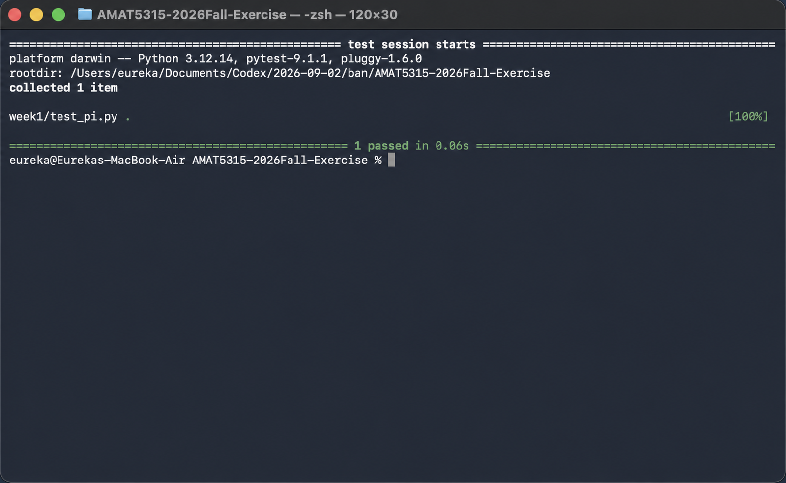

# AMAT5315-2026Fall-Exercise

Weekly exercises for AMAT5315 in Fall 2026 at HKUST(GZ). The Week 1 exercise uses an AI coding agent and Git to develop, test, and publish a Monte Carlo estimator for pi.

## Requirements

- Python 3.10 or newer
- pytest

Install pytest with:

```bash
python3 -m pip install pytest
```

## Run the test

From the repository root, run:

```bash
python3 -m pytest week1/
```

## Test evidence



The screenshot shows `python3 -m pytest week1/` completing successfully with `1 passed`.
